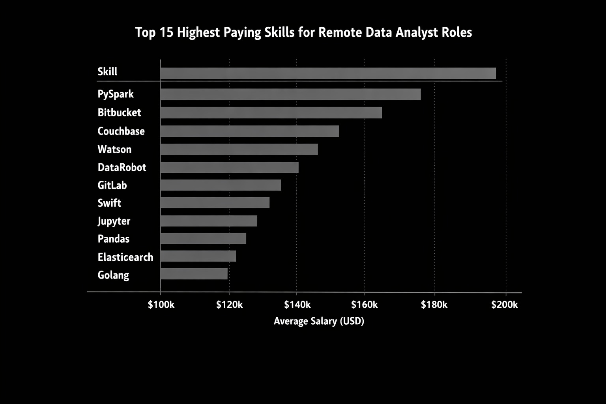
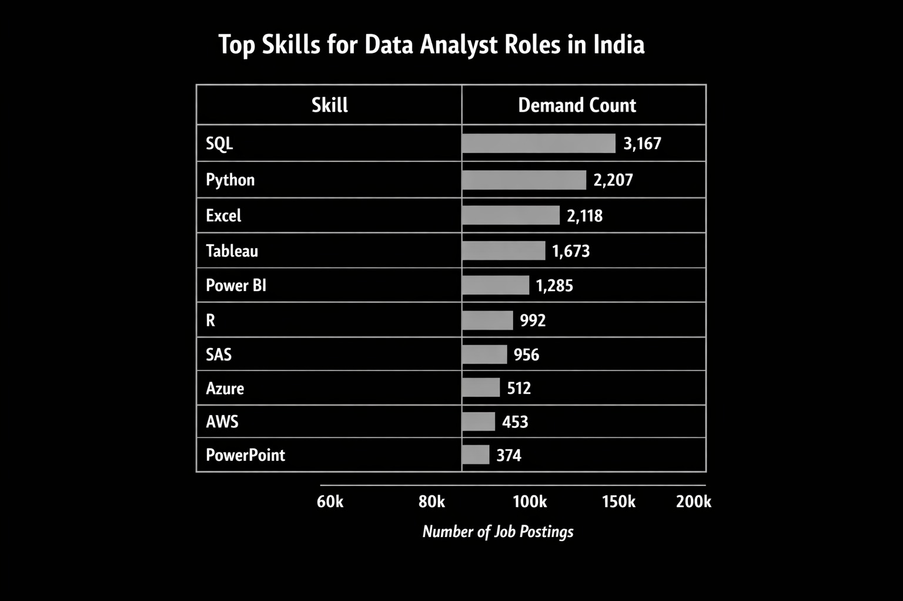
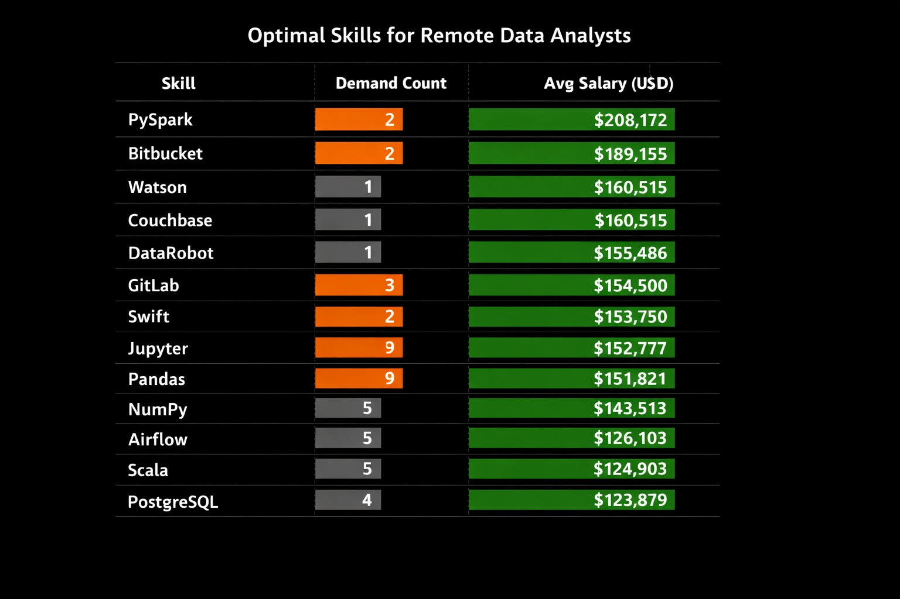

# 📊 SQL Data Analyst Project: Job Market Analysis

## 🔍 Introduction

This project explores the data analyst job market using SQL. It focuses on identifying 💰 high-paying jobs, 🔥 in-demand skills, and 📈 the most optimal skills that balance both demand and salary.

---

## 🧠 Background

The goal of this project is to better understand the data analyst job market by answering the following questions:

- What are the top-paying data analyst jobs?  
- What skills are required for these top-paying jobs?  
- What skills are most in demand for data analysts?  
- Which skills are associated with higher salaries?  
- What are the most optimal skills to learn?  

This project helps in building a clear roadmap for becoming a successful data analyst.

---

## 🛠 Tools Used

- SQL → Core language for analysis  
- PostgreSQL → Database management system  
- Visual Studio Code → Writing and executing queries  
- Git & GitHub → Version control and project sharing  

---

## 📂 Dataset

This project uses 4 relational datasets:

- **job_postings_fact** → Contains job details such as job titles, salaries, locations, and work type  
- **company_dim** → Contains company information and company names  
- **skills_dim** → Contains skill names  
- **skills_job_dim** → Maps jobs to the skills required  

---

## 🔗 Database Relationships

The tables are connected through key relationships:

- job_postings_fact ↔ company_dim (via `company_id`)  
- job_postings_fact ↔ skills_job_dim (via `job_id`)  
- skills_job_dim ↔ skills_dim (via `skill_id`)  

👉 This relational structure allows analysis of job postings, companies, and required skills together.

---

## 📊 The Analysis
Each query for this project aimed at investigating specific aspects of the data analyst job market. Here’s how I approached each question:

### 1. Top Paying Data Analyst Jobs  
To identify the highest-paying roles, I filtered Data Analyst positions in India based on average yearly salary. This query highlights the top-paying opportunities in the field.

```sql
-- Top 10 highest-paying Data Analyst jobs in India with company details

SELECT 
    job_id,
    job_title,
    job_location,
    job_schedule_type,
    salary_year_avg,
    job_posted_date,
    company_dim.name AS company_name
FROM 
    job_postings_fact
LEFT JOIN 
    company_dim
ON company_dim.company_id = job_postings_fact.company_id
WHERE 
    job_title_short = 'Data Analyst'
    AND job_location = 'India'
    AND salary_year_avg IS NOT NULL
ORDER BY 
    salary_year_avg DESC
LIMIT 10;
```
-- Here's the breakdown of the top data analyst jobs in 2023:

● The highest-paying role is Senior Business & Data Analyst at $119,250/year (Deutsche Bank), followed closely by Sr. Enterprise Data Analyst at $118,140/year (ACA Group).

● Mid-tier roles like HR Data Operations Analyst (Clarivate) and Financial Data Analyst still offer strong salaries above $100K, while entry-level or niche positions like Data Analyst I (Bristol Myers Squibb) and IT Data Analytic Architect (Merck Group) fall in the $64K–71K range.

● Overall, analyst roles dominate the dataset, with salaries spanning $64K–119K, showing a clear premium for seniority and specialization.


### 2. Skills for Top-Paying Jobs  
To understand what skills are required for the top-paying jobs, I joined the job postings with the skills data, providing insights into what employers value for high-compensation roles.

```sql
WITH top_paying_jobs AS (
    SELECT 
        job_id,
        job_title,
        salary_year_avg,
        name AS company_name
    FROM 
        job_postings_fact
    LEFT JOIN 
        company_dim
    ON company_dim.company_id = job_postings_fact.company_id
    WHERE 
        job_title_short = 'Data Analyst'
        AND job_location = 'India'
        AND salary_year_avg IS NOT NULL
    ORDER BY 
        salary_year_avg DESC
    LIMIT 10
)

SELECT 
    top_paying_jobs.*,
    skills_dim.skills AS skills
FROM top_paying_jobs
LEFT JOIN skills_job_dim
ON top_paying_jobs.job_id = skills_job_dim.job_id
LEFT JOIN skills_dim
ON skills_job_dim.skill_id = skills_dim.skill_id
ORDER BY salary_year_avg DESC;
```

-- Here's the breakdown of the most demanded skills for the top 10 highest paying data analyst jobs in 2023:

● Senior and specialized roles (Senior Business & Data Analyst, AI Research Engineer) command salaries above ₹100L, showing strong strategic value.

● These roles consistently require advanced skills — Python, SQL, Power BI, ML frameworks (Scikit-learn/TensorFlow), and cloud platforms (AWS/Azure/GCP).

● The highest-paying jobs are concentrated in tech, finance, and healthcare multinationals, reflecting mature data ecosystems and global demand.



---

### 3. Most In-Demand Skills  
This query helped identify the skills most frequently requested in job postings, directing focus to areas with high demand.
```sql
SELECT 
    skills,
    count(skills_job_dim.job_id) AS skill_count
FROM job_postings_fact
LEFT JOIN skills_job_dim
ON job_postings_fact.job_id = skills_job_dim.job_id
LEFT JOIN skills_dim
ON skills_job_dim.skill_id = skills_dim.skill_id
WHERE 
    job_title_short = 'Data Analyst'
    AND job_country = 'India'
GROUP BY skills
ORDER BY skill_count DESC
LIMIT 10;
```
-- Here's the breakdown of the most demanded skills for data analysts in 2023:

● SQL dominates with over 3,000 postings, making it the single most essential skill for Data Analysts in India.

● Python and Excel are nearly tied for second place, showing strong demand for both programming and spreadsheet proficiency.

● Visualization tools like Tableau and Power BI plus statistical tools (R, SAS) remain highly relevant, especially in analytics and research-heavy roles.


---

### 4. Skills Based on Salary  
Exploring the average salaries associated with different skills revealed which skills are the highest paying.
```sql
SELECT 
    skills,
    ROUND(AVG(salary_year_avg),0) AS avg_salary
FROM job_postings_fact
LEFT JOIN skills_job_dim
ON job_postings_fact.job_id = skills_job_dim.job_id
LEFT JOIN skills_dim
ON skills_job_dim.skill_id = skills_dim.skill_id
WHERE 
    job_title_short = 'Data Analyst'
    AND salary_year_avg IS NOT NULL
    AND job_work_from_home = TRUE
GROUP BY skills
ORDER BY avg_salary DESC
LIMIT 25;
```
-- Here's a breakdown of the results for top paying skills for Data Analysts:

● PySpark ($208K) leads the pack, followed by Bitbucket and Couchbase, showing niche but extremely lucrative skills.

● ML & Data Science tools — DataRobot, Jupyter, Pandas, NumPy — consistently deliver salaries above $140K, proving their central role in remote analytics.

● DevOps, cloud, and programming skills — GitLab, Golang, Kubernetes, Swift — are highly valued, blending engineering with analytics for premium pay.



---

### 5. Most Optimal Skills to Learn  
Combining insights from demand and salary data, this query aimed to pinpoint skills that are both in high demand and have high salaries, offering a strategic focus for skill development.
```sql
WITH skills_demand AS (
    SELECT 
        skills_job_dim.skill_id,
        COUNT(skills_job_dim.job_id) AS skill_count
    FROM job_postings_fact
    LEFT JOIN skills_job_dim
        ON job_postings_fact.job_id = skills_job_dim.job_id
    WHERE 
        job_title_short = 'Data Analyst'
        AND salary_year_avg IS NOT NULL
        AND job_work_from_home = TRUE
    GROUP BY skills_job_dim.skill_id
),
average_salary AS (
    SELECT 
        skills_job_dim.skill_id,
        ROUND(AVG(salary_year_avg), 0) AS avg_salary
    FROM job_postings_fact
    LEFT JOIN skills_job_dim
        ON job_postings_fact.job_id = skills_job_dim.job_id
    WHERE 
        job_title_short = 'Data Analyst'
        AND salary_year_avg IS NOT NULL
        AND job_work_from_home = TRUE
    GROUP BY skills_job_dim.skill_id
)

SELECT 
    skills_dim.skills,
    skills_demand.skill_count,
    average_salary.avg_salary
FROM skills_demand
INNER JOIN average_salary
    ON skills_demand.skill_id = average_salary.skill_id
LEFT JOIN skills_dim
    ON skills_dim.skill_id = skills_demand.skill_id
ORDER BY 
    average_salary.avg_salary DESC,
    skills_demand.skill_count DESC
LIMIT 25;
```
-- Here's a breakdown of the most optimal skills for Data Analysts in 2023:

● High-paying niche skills like PySpark ($208K) and Bitbucket ($189K) are rare (only 2 postings each), but extremely lucrative — showing scarcity drives premium pay.

● Balanced skills such as Pandas (9 postings, $151K) and Databricks (10 postings, $141K) combine strong demand with solid salaries, making them the most practical career investments.

● Supporting tools like NumPy, Airflow, Scala, PostgreSQL hold steady relevance with moderate demand (3–5 postings) and salaries in the $122K–143K range, ensuring versatility in remote analytics.



---

## 🎯 Key Takeaways

- SQL, Python, and Excel are core essential skills  
- Visualization tools like Tableau and Power BI are highly valuable  
- Advanced skills (ML, cloud, big data) increase salary potential  
- Niche skills unlock higher-paying opportunities  


## 🚀 What I Learned

- Writing advanced SQL queries (joins, CTEs, aggregations)  
- Working with relational databases  
- Extracting meaningful insights from real-world data  
- Structuring and presenting a complete data analysis project  

---

## 🔥 Conclusion

This project provides a clear view of the data analyst job market and highlights the importance of balancing foundational and advanced skills.

By focusing on both high-demand and high-paying skills, aspiring data analysts can position themselves effectively in a competitive job market.
